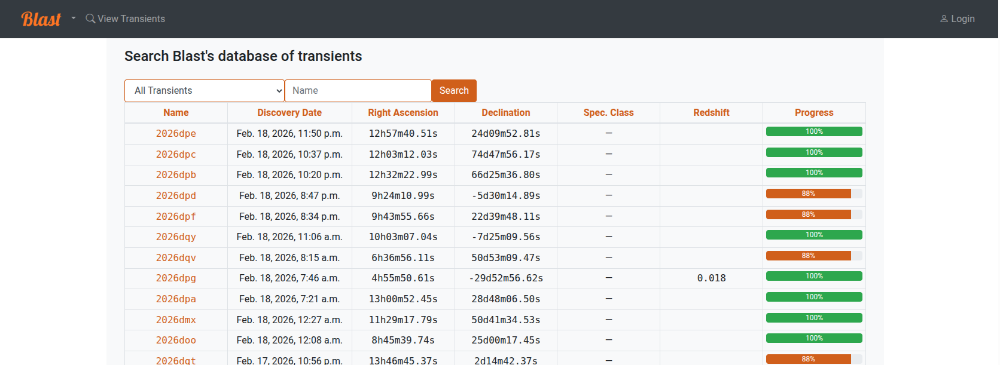
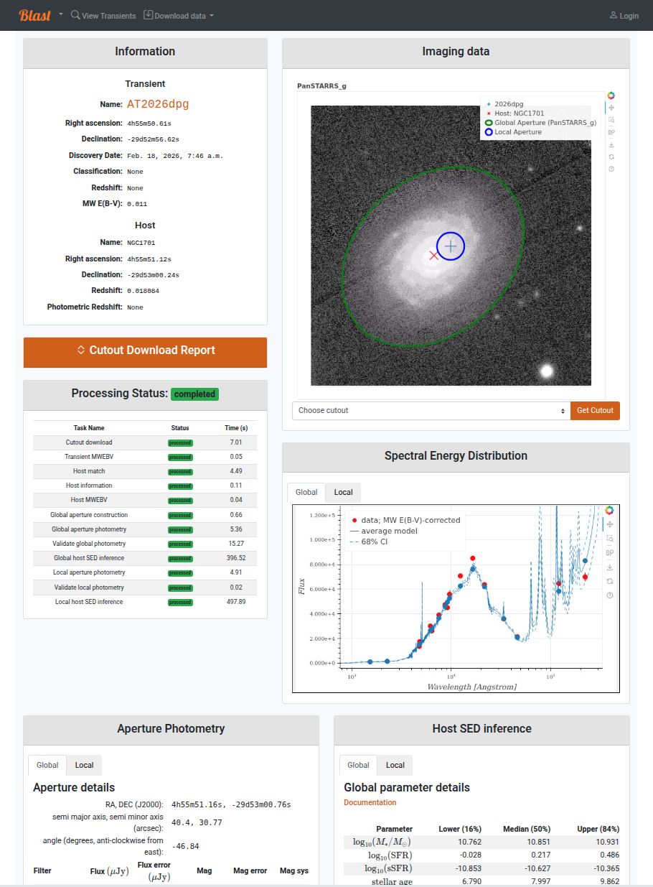
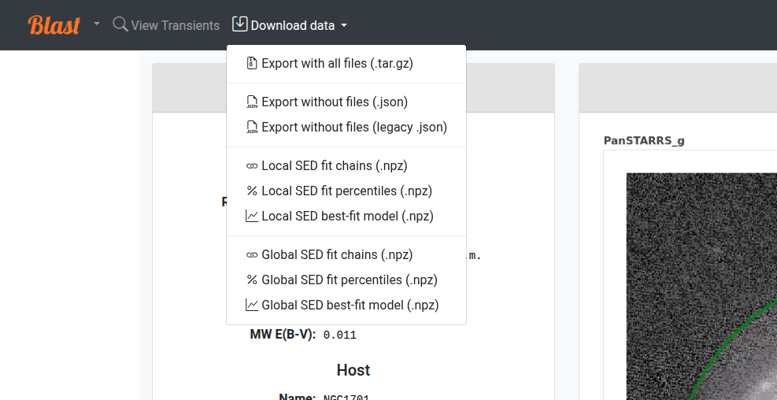
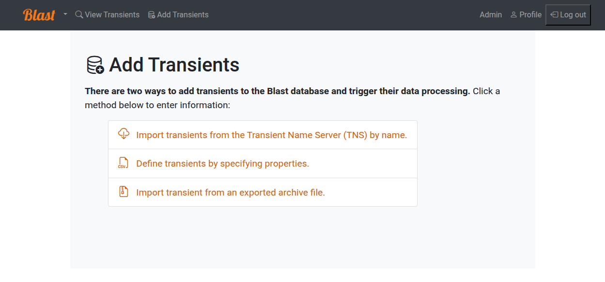

Web Pages
=========

Blast is a fairly simple interface, with basic pages that list transients, give details
for each transient, and allow authorized users to upload transients.  Details are given below.

List of Ingested Transients
---------------------------

The transient list page :code:`<blast_base_url>/transients`, contains
a simple list of ingested transients with links to the transient
information page for each one.  A user can sort the list by name
or by set of categories based on how much of the processing
status has completed successfully, using the search bar at the top of the
table (see below).

Individual Transient Pages
--------------------------

The individual transient pages list details of a given transient as well as its downloaded cutout images, photometric apertures, photometry, and SED properties.  Cutout image and SED plots are interactive [#bokeh]_.  The status of a transient's processing is given as well. Authorized users will see an additional column with buttons to report issues with specific processing stages; for example, a poor estimation of isophotal aperture radius, or a SED model that does not fit the data. These reports will cause the task to be highlighted in red font, and "warnings" will appear at the top of the page by the transient name. The goal of reporting is to help users avoid dubious results, but there is no need to flag stages that already have a "failed" status.

Downloading data
++++++++++++++++

All data associated with a transient can be downloaded using the :code:`Download Data` dropdown menu in the navigation bar. Each data product linked from the menu can also be accessed programmatically via the REST API; see the :ref:`api` for additional information on each column as well as how to execute queries on individual database tables via the API. See :ref:`exporting_transients`

If SED fitting data is available, the download menu will display links for 1) parameter estimation chains, 2) parameter confidence intervals, and 3) best-fit models and uncertainties. These files are in :code:`.npz` format and can be read with :code:`np.load`.  Parameters correspond to the Prospector-alpha model, with details given `here <https://arxiv.org/abs/1609.09073>`_.  To do these downloads programmatically, see :ref:`sedfittingresult`.

Authorized Users
----------------

Users with an authorized Blast account can (1) add transients and (2) re-run transient workflow tasks. To obtain an account, click "Profile" in the top-right corner of the screen, log in with your preferred identity provider (typically your university or home institution), and follow the instructions to request authorization. 

If you are running Blast locally, use the "click here if you are a Blast administrator" option to login with a local account such as the default ``admin`` superuser that is provisioned the first time Blast is launched.

.. _adding_transients:

Adding New Transients
++++++++++++++++++++++++

A link to the Add Transient page, :code:`<blast_base_url>/add` will
appear in the toolbar at the top of the page for authorized users. There
are three methods of adding new transients:

- Import transients from the Transient Name Server by name.
- Define transients by specifying properties as a CSV-formatted table.
- Import transient from an exported archive file.

Follow the detailed instructions for each method that are displayed on the page.

Restarting Processing
+++++++++++++++++++++
Near the top of each transient list page, authorized users will see buttons labeled "Retrigger" and "Reprocess". Sometimes a transient workflow fails to complete due to a temporary operational error (for example, a "transient" 😉 networking failure preventing the download of a cutout image from a remote catalog). In these cases, "retriggering" the workflow will retry failed tasks and run tasks that have not yet been processed. Retriggering a workflow is a safe operation. The "Reprocess" button, however, will reset a workflow to its initial state and run all tasks again as if the transient were new. There is rarely a reason to reprocess a transient instead of retriggering it.

.. rubric:: Footnotes

.. [#bokeh] Interactive plots use the Bokeh library. See :ref:`software_acknowledgements`.
